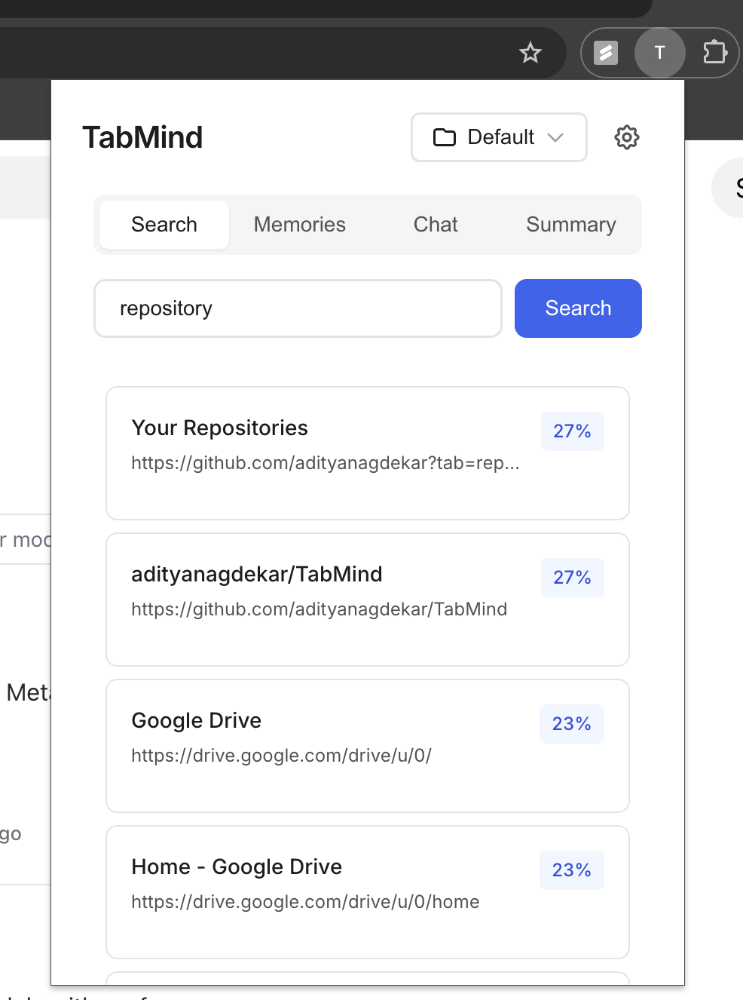
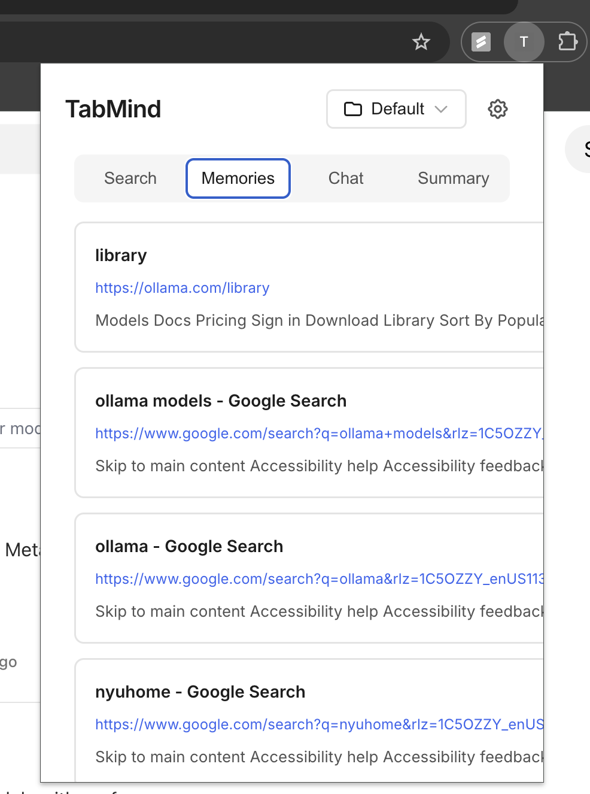

# TabMind

Chrome extension for semantic search over your browsing history using AI embeddings.

## Screenshots



*Semantic search interface for natural language queries*



*Timeline view of all indexed pages organized by project*

## What's Done

**Core Features**
- Semantic search across browsing history using OpenAI embeddings
- Automatic page content extraction and indexing as you browse
- Project-based organization (create separate workspaces for different contexts)
- Memories view: chronological timeline of indexed pages
- Settings management for API configuration

**Technical Implementation**
- Manifest V3 Chrome extension
- OpenAI `text-embedding-3-small` model (1536-dimensional vectors)
- IndexedDB storage via Dexie
- React-based popup UI with tab navigation
- Vite build system with multi-entry bundling

## What's Coming

- **Chat View**: Ask questions about your browsing history and get AI-powered answers
- **Summary View**: Generate markdown summaries of browsing sessions

## Quick Start

```bash
# Install dependencies
npm install

# Build the extension
npm run build

# Load dist/ folder as unpacked extension in Chrome
```

**Required**: Create `.env` file with your OpenAI API key:
```
VITE_OPENAI_API_KEY=your_key_here
```

## Project Structure

- [background.js](background.js) - Service worker for embedding generation
- [content/](content/) - Page content extraction
- [ui/src/](ui/src/) - React popup interface
  - [components/views/SearchView.jsx](ui/src/components/views/SearchView.jsx) - Semantic search
  - [components/views/MemoriesView.jsx](ui/src/components/views/MemoriesView.jsx) - Timeline view
  - [db.js](ui/src/db.js) - IndexedDB schema and operations
  - [embeddings.js](ui/src/embeddings.js) - OpenAI API integration

## Development

```bash
npm run build    # Rebuild after changes
# Then reload extension in chrome://extensions
```

See [CLAUDE.md](CLAUDE.md) for detailed architecture and development notes.
